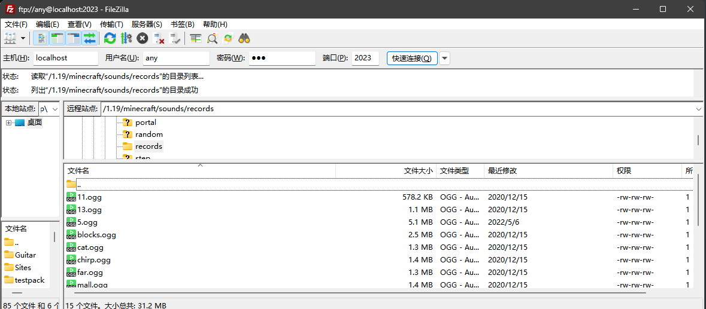

[简体中文](README.md)

# Minecraft Assets FTP Server

A FTP Server used to access directory `.minecraft/assets`

## miao？

Some assets file, like music, sounds, translations, etc., are stored in `.minecraft/assets`, but the organization of these files is diffcult for human to access directly.

## Installation

```bash
$> npm install mcafs
```

or

```bash
$> git clone https://github.com/LEAWIND/mcafs.git
$> cd mcafs
$> npm install
```

## Usage

```bash
$> mcafs -u localhost:2023
```

Outputs

```bash
$> mcafs -u localhost:2023
[2023-10-05T12:24:32.942] [INFO] MCAFS - Minecraft Assets Directory: C:\Users\LEAWIND\AppData\Roaming\.minecraft\assets
[2023-10-05T12:24:32.983] [INFO] MCAFS - FTP Server is starting at ftp://localhost:2023/
```

You can access  `ftp://localhost:2023` by any FTP client



## CLI Options

| flags                        | default                           | description                                                  | choices                                        |
| ---------------------------- | --------------------------------- | ------------------------------------------------------------ | ---------------------------------------------- |
| -v --version                 |                                   | Display version                                              |                                                |
| -h --help                    |                                   | Display help                                                 |                                                |
| -d --assertsDir \<assetsDir> | default path to .minecraft/assets | customize path to assets directory                           |                                                |
| -u --url \<url>              |                                   | URL like ftp://0.0.0.0:2023. If specified, option addr and port will be ignored |                                                |
| -a --addr \<addr>            | 127.0.0.1                         | IP Address                                                   |                                                |
| -p --port \<port>            | 21                                | FTP port                                                     |                                                |
| -l --logLevel \<logLevel>    | info                              | log level                                                    | all,trace,debug,info,warn,error,fatal,mark,off |

### Others

<del>windows explorer sucks</del> It is recommended to use FTP Clilent like FileZilla to access This FTP Server.

## TODO

* [ ] no need to create FileSystem instance for each login
* [ ] no need to load all index files at begining

